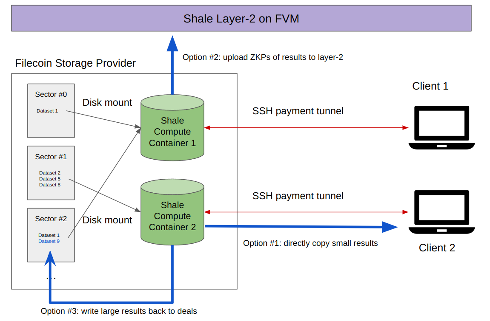

# Shale - Decentralized Cloud

Shale is aiming to bring cloud computing to Filecoin and make Storage Providers (SPs) directly compete with AWS, Google Cloud, etc..

With Shale, SPs are able to get FILs by leasing/monetizing their computing devices (CPU/RAM/GPU servers) with access to their sealing data.

Shale is targeting on native high-performance computing such as AI/ML training/inference, usually against large/open datasets. Any traditional tasks are possible, such as C/C++ compiling, short-time web serving, general data-processing etc..

## Design

The idea is sending programs around to where the data locate (i.e. the data center of SP), and utilizing those Filecoin+ deals by disk mouting.

Programs here refer to off-chain, native C/C++, CUDA executables.



### SSH-payment-tunnel

Just like normal SSH, but equipped with a local cryptographic payment tunnel, which accumulates fractional payments and aggregates them to ZK proofs in the end.
The ZK proofs will be posted to Shale layer-2 by SPs.

Both parties could terminate the lease anytime.

The design is to accommodate future plugins for in-place monitering/benchmarking of session quality to catch potential cheating behaviours.

### Shale Layer-2 Marketplace

There will be smart contracts on FVM for coordinating orders between clients and SPs, where:

* Clients create orders with their SSH pub-keys, prices, time and resource requirments
* SPs accept orders, confirming by clients with collaterals
* SPs upload payment-tunnel ZKPs to claim rewards
* Clients post ratings/reviews based on their time/usage.

### High-performance native computing

Programs are running natively in container with access to local accelerators (GPU).

All traditional web1/web2 software ecosystems (unix, apt-get, gcc, python, nodejs, etc.) become available, thanks to container technology.

Examples: C/C++ compiling, ML training/inference, general data pipline/processing, short-time serving etc.. 

## Implementation

The first implementation is a terminal command-line tool (CLI) that focused on demostrating the using experiecnes, which includes:

* Client lists SPs with available datasets 
* Client sends request to particular SP
* SP spawns docker containers on GPU server
* SP auto-provisions SSH server and client's pub-key inside container
* Mock SSH-payment-tunnel UI
* Client runs a ML training task remotely in the container

## Client-side

For those who have Shales(FILs) and want to rent computing units.

### Request a container
```bash
shale give-me-container \
  --miner=f01946720 \
  --price=0.01fil/min \
  --num_cpus=10 \
  --num_rams=12Gi \
  --num_gpus=1 \
  --bandwidth=1Mi \
  --image=cuda-ubuntu18.04 \
  --mnt=<data_cid_1>:/mnt/mnist.zip \
  --mnt=<data_cid_2>:/mnt/cifar-100.zip \
  -- bash
```

## Server-side

For those storage providers who want to lease their server.

### Start a specfic container per request (low-level command)

```bash
shale start-specific-container
```

### Start Daemon

Daemon that accepts requests and start containers automatically.

TBD.
